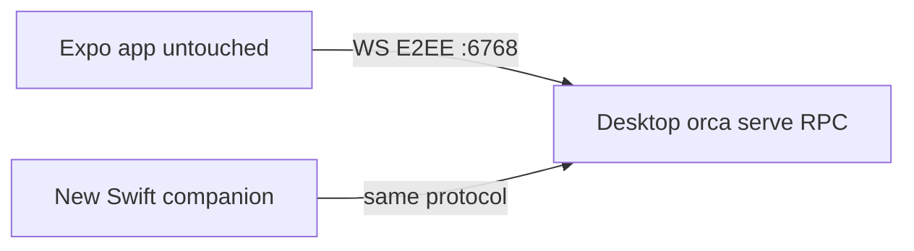

# Separate Swift Power-Efficient iOS Companion

## Intent (locked)

- **Separate app**, not an Expo rewrite. Keep `mobile/` (React Native) as-is for daily/App Store use.
- **SwiftUI + libghostty** for the terminal surface.
- **Dev/fork only** for now — no App Store replacement plan.
- **Parity destination** via **vertical slices** (usable after each slice), not a big-bang.

## Where it lives

New tree: `apps/orca-ios/` (Xcode project / SPM package).

- Does **not** modify Expo screens or replace TestFlight of the current app.
- Reuses host protocol from Phase 2: `src/shared/workspace-attach.ts`, `docs/reference/workspace-attach-contract.md`, mobile protocol-version.
- Swift ports the wire types — **no dependency on Metro**.

## Power-efficiency rules (non-negotiable)

1. **One live Ghostty surface** — inactive tabs unmounted; restore from `terminal.subscribe` snapshot.
2. **Background → `role=notify`** — no glyph stream; use `notifications.subscribe` for agent-complete. Foreground terminal → `interactive`.
3. **No WKWebView terminal**.
4. **Parked transport** after fast retry; revive on foreground / network.

## Parity slices (destination = Expo inventory)

| Slice | Ships |
|---|---|
| S0 | Xcode shell, Keychain, protocol-version gate |
| S1 | Pair QR + host list + status |
| S2 | Worktree list + session open |
| S3 | libghostty one-pane terminal + input bar |
| S4 | Background notify role + local notifications |
| S5 | Multi-tab + park/snapshot restore |
| S6 | Source control hub |
| S7 | PR sidebar/review |
| S8 | Files explorer + preview |
| S9 | Tasks / accounts / history / settings / dictation |

## libghostty

- Expo stub `mobile/packages/expo-ghostty-terminal/` stays an RN experiment — not this app.
- Swift app vendors libghostty as XCFramework / static lib.
- Spike before S3: build for simulator + device, hello grid.
- If spike fails: SwiftTerm behind `TerminalEngine` protocol; still no WebView.

## Risks

| Risk | Mitigation |
|---|---|
| Parity is multi-month | Phased slices; Expo stays daily driver |
| libghostty immature on iOS | Time-box spike; SwiftTerm escape hatch |
| Dual clients / protocol bumps | Compat gate + blocked screen |
| E2EE bugs | Port proven handshake; golden tests |
| Wrong role steals eyes | `role=notify` when backgrounded |
| Kill live Orca | Never overwrite `/Applications/Orca.app`; pair to `:6768` |
| App Store confusion | Dev bundle id `dev.orca.companion.swift` |
| Battery regress | Single surface + notify role; Instruments gate |

## Non-goals

- Do not rewrite/delete Expo `mobile/`.
- Do not App Store replace in this phase.
- Do not replace daemon PTYs with tmux.
- Android out of scope for this track.

## Progress

- **S0 done:** `apps/orca-ios/` XcodeGen project, SwiftUI shell, `ProtocolVersion` (v3/min 2), Keychain smoke, unit tests green on iOS Simulator. Bundle id `dev.orca.companion.swift`. Expo untouched; live Orca not relaunched.
- **libghostty spike done (VT):** tip `ghostty-vt.xcframework` linked (iOS + simulator). `GhosttyVtEngine` write→plain-text snapshot unit tests green. Honest scope: this is **VT core**, not Metal glyphs — S3 still needs a render path (render-state → CoreText/Metal, or SwiftTerm escape hatch via `TerminalEngine`). Fetch via `apps/orca-ios/Scripts/fetch-ghostty-vt.sh` (binaries gitignored).
- **S1 wire done (tests only):** `PairingOffer` parser, `E2EECrypto`/`E2EEHandshake`, `HostStore` (UserDefaults metadata + Keychain tokens), `OrcaRpcClient` over injectable `WebSocketChannel` (handshake + unary `sendRequest`). Golden unit tests green; **no live `:6768` pair yet**, Expo untouched.
- **First usable (S1 UI + S2 peek):** Liquid Glass host list / paste-pair sheet / connect + `status.get` protocol gate / `worktree.ps` list / activate + `session.tabs.list` peek. Deployment iOS 26 for `.glassEffect`. Still no Ghostty glyph pane (S3).
- **S3 done (plain VT pane):** `terminal.subscribe` streaming + encrypted binary frames → `GhosttyVtEngine` plain-text snapshot + input via `terminal.send`. Single-pane energy rule. Liquid Glass chrome retained. Unit tests green. Glyph/Metal render still future polish.
- **Metal glyphs done:** Ghostty `render-state` → `TerminalFrame` cell grid → CoreText **glyph atlas** + **Metal** quads (`MetalTerminalView`). `TerminalPaneView` uses MTKView instead of plain `Text`. Capture tests green.
- **Metal polish:** persistent render-state + dirty-row / clean-frame short-circuit; vertex buffer reuse + partial row patch; atlas wrap with generation bump; emoji cascade + wide-cell width heuristic.
- **Metal polish complete (loop):** cursor-aware dirty patches; RGBA atlas + CTTypesetter ligatures + color-emoji fragment path; atlas overflow wrap mid-rebuild restart. Unit tests cover wrap / fi cache / wide emoji.

## Next when approved

1. Optional live attach to already-running `:6768` (never relaunch Orca).
2. S4 background `role=notify` + local notifications; then S5+ parity.
